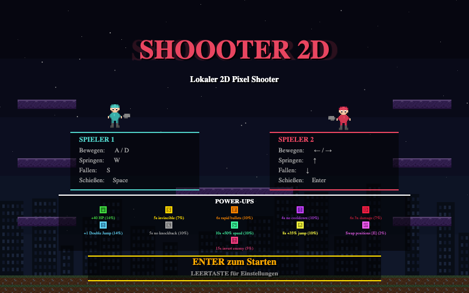

# SHOOOTER 2D

A local multiplayer 2D pixel shooter game built with HTML5 Canvas and vanilla JavaScript. No frameworks, no dependencies - just pure browser fun!



## Play Now

**[Play in your browser!](https://djangomuc.github.io/Shoooter-2D/)**

## Features

- **Local Multiplayer** - Player vs Player or Player vs AI
- **5 Game Modes:**
  - Classic - Reduce enemy HP to 0
  - One Shot - 1 HP, one hit kills!
  - King of the Hill - Hold the glowing zone to score
  - Tag - Avoid being the tagger!
  - Lava Rise - Climb upward as lava rises, last alive wins!
- **15 Power-Ups** - Heal, Shield, Rapid Bullets, Half Cooldown, 3x Damage, Extra Life, Double Jump, No Knockback, Speed Boost, Super Jump, Swap, Lava Freeze, Platform Spawn, Invert Controls, Mega Knockback
- **Special Platforms** - Ice (slippery!), Bounce (trampolines!), Breakable, Moving
- **Wind Zones** - Horizontal wind pushes you sideways mid-air
- **Procedural Structures** - Lava Rise generates unique climbing challenges
- **Customizable Settings** - HP, gravity, rounds, AI difficulty, skins, key bindings, and more
- **Pixel Art Style** - Retro aesthetics with modern gameplay
- **Bilingual** - English & German (Deutsch)

## Controls

| Action | Player 1 | Player 2 |
|--------|----------|----------|
| Move | A / D | Arrow Left / Right |
| Jump | W | Arrow Up |
| Drop | S | Arrow Down |
| Shoot | Space | Enter |
| Swap (inventory) | E | Right Shift |

Press **ESC** to return to menu at any time.

## How to Run Locally

1. Clone the repository:
   ```bash
   git clone https://github.com/DjangoMuc/Shoooter-2D.git
   cd Shoooter-2D
   ```
2. Start any local web server:
   ```bash
   python3 -m http.server 8080
   ```
3. Open `http://localhost:8080` in your browser.

## Tech Stack

- HTML5 Canvas (800x500)
- Vanilla JavaScript (~6000 lines)
- No external dependencies

## License

Made with fun in mind.
